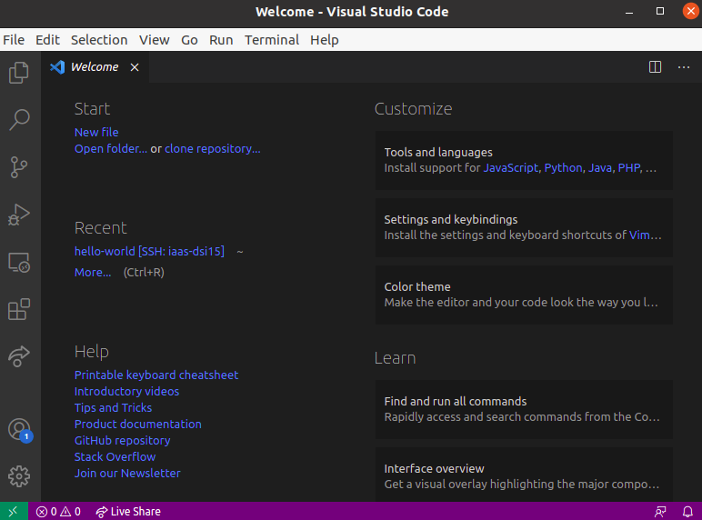
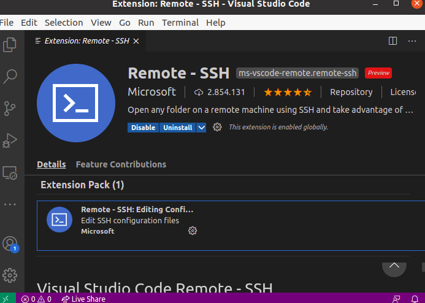

# Desarrollo de Sistemas Informáticos
## Práctica 2 - Instalación y Configuración de Visual Studio Code
## Yago Pérez Molanes
__*Contenidos del informe*__

__*Pasos realizados para el desarrollo de la práctica*__
* Algunas tareas a realizar previamente:
	* Aceptar la tarea asignada a [GitHub Classroom](https://classroom.github.com/assignment-invitations/aeecb6b9d939b7fd914ea3c40d832362/status) asociada a esta práctica.
	* Leer la [introducción a Markdown](https://guides.github.com/features/mastering-markdown/).Este es el lenguaje que se usará en el desarrollo del presente informe.
	* Lectura del recurso [GitHub Pages](https://docs.github.com/en/github/working-with-github-pages), ya que el presente informe se presentará a modo de una página web de GitHub.
      
## __Introducción y Objetivos__
En esta llevaremos a cabo la instalación y la configuración del entorno de desarrollo que usaremos durante las prácticas, Visual Studio Code.

Cuando finalicemos el desarrollo tendremos a punto el IDE para ayudarnos a realizar las siguientes prácticas.

## __Instalación y funcionalidad de Visual Studio Code__
El entorno de desarrollo que vamos a usar en las prácticas es [Visual Studio Code](https://code.visualstudio.com/).Lo primero que deberemos hacer será [instalarlo](https://code.visualstudio.com/docs/setup/setup-overview) en nuestra máquina local.

Si tuvieramos una distribución Linux *Debian/Ubuntu* la instalación se reduciría a los siguientes comandos en una terminal:

```markdown
yago@yago-X541UJ:~$ sudo apt install code

```
Es posible que nos pida la contraseña de nuestra cuenta.
También se puede hacer uso de *snap* para instalar code 

```markdown
yago@yago-X541UJ:~$ sudo snap install code --classic

```

Una vez que tenemos code instalado podemos ejecutarlo en el escritorio o en el menú de aplicaciones, o incluso con el comando *code*, en una terminal, a la vez que podemos indicarle como argumento alguno de los directorios sobre los que queremos trabajar.

Este es el aspecto que tendría code según lo ejecutamos.




## __Conexión a una máquina virtual ssh con Visual Studio Code__
Vamos a llevar a cabo la configuración necesaria para [conectarnos](https://code.visualstudio.com/docs/remote/ssh-tutorial) desde Visual Studio Code a la máquina virtual del *IaaS*, a través de una conexión *ssh*.

Recordamos que de la práctica anterior tenemos configurada la máquina virtual del IaaS, entonces podemos establecer una configuración VPN si no nos encontramos en la red universitaria y conectarnos por *ssh* en una terminal.

Sin embargo también podemos hacerlo desde Visual Studio Code, a través de una [extensión](https://code.visualstudio.com/docs/editor/extension-gallery)

Una extensión es una funcionalidad que se puede añadir a Visual Studio Code, nosotros vamos a instalar __Remote SSH__:


Seguidamente, deberemos pulsar la tecla __F1__ o la combinación de teclas __Ctrl + Shift + P__, en el menú desplegable escribimos la orden __ssh__ y después __Connect to host...__.

Recordamos de la anterior práctica que ya habíamos configurado el fichero que contenía la configuración de *ssh*, de ahí que podamos seleccionar el nombre que se indica de la máquina virtual. 

En el caso de que no suceda lo anterior, podemos pulsar sobre la opción __Configure SSH Hosts...__ y elegimos la opción __~/.ssh/config__, incluyendo las siguientes líneas:

```markdown
Host iaas-dsi15
  HostName iaas-dsi15
  User usuario
```
Como vemos la máquina es *iaas-dsi-15* que es la que nos había asignado el *iaas* y el usuario no lo hemos cambiado, sino que lo hemos dejado por defecto.Sin embargo, para cada máquina esta tendrá un nombre distinto.

Una vez seguidos estos pasos, lo siguiente será la opción __Connect to Host__ cuando volvamos a abrir el menú desplegable con __F1__, en este caso seleccionamos la máquina virtual, y nuestras credenciales, esto es, la contraseña para el usuario que hemos añadido en el fichero de configuración anterior.

Esto originará una nueva ventana del Visual Studio Code, que iniciará la conexión remota, podemos abrir una terminal desde el propio Code, con la combinación de teclas __Ctrl + Shift +__.En la terminal podemos teclear el siguiente comando:

```markdown
[~/ull-esit-inf-dsi-20-21-prct02-vscode-alu0101254678/docs(master)]$hostname
iaas-dsi15
[~/ull-esit-inf-dsi-20-21-prct02-vscode-alu0101254678/docs(master)]$
```


## Welcome to GitHub Pages

You can use the [editor on GitHub](https://github.com/ULL-ESIT-INF-DSI-2021/ull-esit-inf-dsi-20-21-prct02-vscode-alu0101254678/edit/master/docs/index.md) to maintain and preview the content for your website in Markdown files.


### Markdown

Markdown is a lightweight and easy-to-use syntax for styling your writing. It includes conventions for

```markdown
Syntax highlighted code block

# Header 1
## Header 2
### Header 3

- Bulleted
- List

1. Numbered
2. List

**Bold** and _Italic_ and `Code` text

[Link](url) and 
```

For more details see [GitHub Flavored Markdown](https://guides.github.com/features/mastering-markdown/).

### Jekyll Themes

Your Pages site will use the layout and styles from the Jekyll theme you have selected in your [repository settings](https://github.com/ULL-ESIT-INF-DSI-2021/ull-esit-inf-dsi-20-21-prct02-vscode-alu0101254678/settings). The name of this theme is saved in the Jekyll `_config.yml` configuration file.

### Support or Contact

Having trouble with Pages? Check out our [documentation](https://docs.github.com/categories/github-pages-basics/) or [contact support](https://support.github.com/contact) and we’ll help you sort it out.
